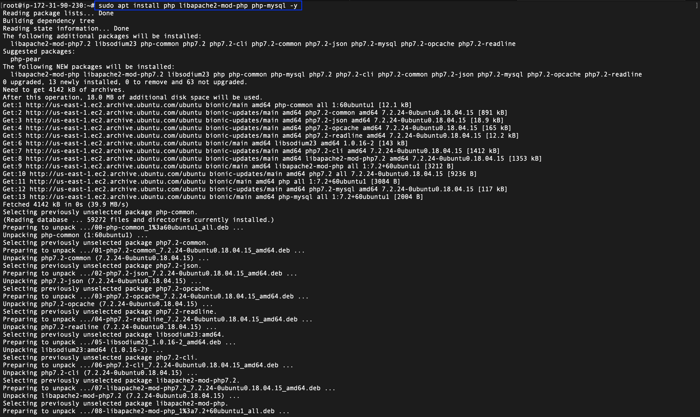
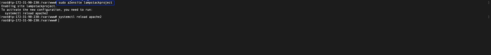
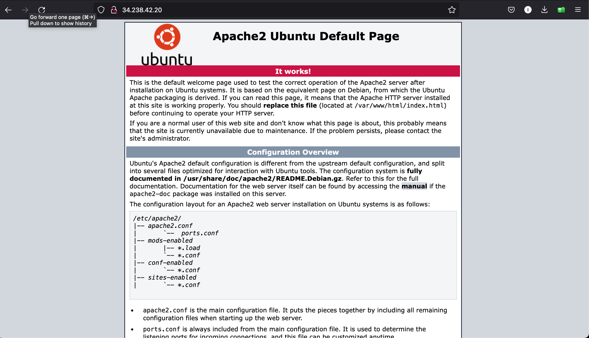
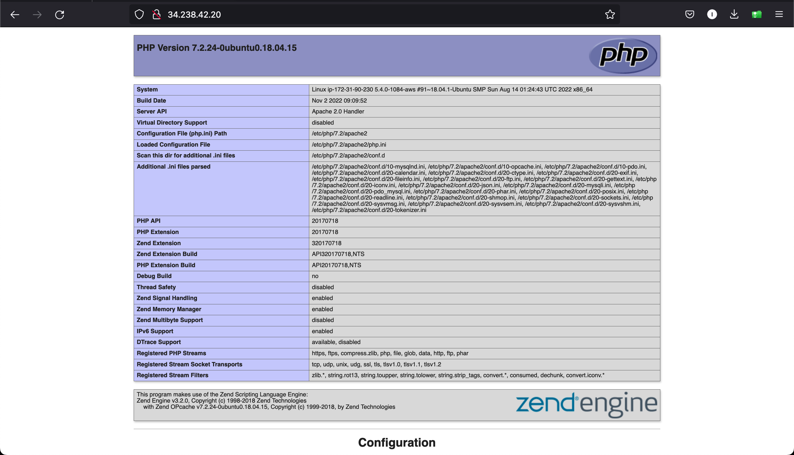

## Documentation For AWS LAMP STACK IMPLEMENTATION
# This Project shows how to implement LAMP(Linux,Apache,Mysql,PhP) on AWS

Before launching the Ubuntu virtual machine we need to install some dependencies on our local machine 

- [Install OpenSSH](https://learn.microsoft.com/en-us/windows-server/administration/openssh/openssh_install_firstuse?tabs=powershell#tabpanel_1_powershell)

- [OpenSSH Key Management](https://learn.microsoft.com/en-us/windows-server/administration/openssh/openssh_keymanagement#user-key-generation)

This dependcies help to authenticate your laptop to have access to the server and github easily

After launching the Ubuntu Virtual machine on AWS Account, Update it using;

**`sudo apt update`**

After the update is completed, following the instruction fromt the task assigned

Install Apache using Ubuntu’s package manager ‘apt’:

**`sudo apt install apache2`**

To verify that apache2 is running as a Service in our ubuntu instance, use following command:

**`sudo systemctl status apache2`**

Below is the outcome of the apache status, which shows it is running and active


## .............................. INSTALLING MSQL................................
 --- 

Install Mysql on the ubuntu server.

 **`$ sudo apt install mysql-server -y`**


Log into the MySQL console

**`sudo mysql`**

configure a database user on and set login password for Mysql

**`ALTER USER 'root'@'localhost' IDENTIFIED WITH mysql_native_password BY 'PassWord.1';`**

Exit the shell with **`Exit`**

Start MYSQL Interactive script, this will prompt you to configure the validate password plugin.

**`sudo mysql_secure_installation`**

Confirm ability to login to Mysql by running the commmand.

**`sudo mysql -p`**

To exit the MySQL console, type:

**`mysql> exit`**


## ................................ INSTALLING PHP ..................................
---


We will install 3 packages namely php, libapache2-mod-php, php-mysql. run this command to install all packages listed.

**`sudo apt install php libapache2-mod-php php-mysql`**

Confirm the php version

**`php -v`**



At this point we have successfully installed all 4 applications that make up the lamp stack

- [x] Linux
- [x] Apache Http Server
- [x] MySQL
- [x] PHP

##  ...........CREATING A VIRTUAL HOST FOR YOUR WEBSITE USING APACHE .........

We will setup a virtual host to test the PHP script, virtual host enables you to setup multiple websites on a single server.

Create the directory for projectlamp using ‘mkdir’ command

**`sudo mkdir /var/www/lampstackpoject`**

Next, assign ownership of the directory with your current system user:

**`sudo chown -R $USER:$USER /var/www/lampstackpoject`**

Create and open a new configuration file in Apache’s sites-available directory.

**`sudo vi /etc/apache2/sites-available/lampstackpoject.conf`**

```
<VirtualHost *:80>
    ServerName lampstackpoject
    ServerAlias lampstackpoject 
    ServerAdmin webmaster@localhost
    DocumentRoot /var/www/lampstackpoject
    ErrorLog ${APACHE_LOG_DIR}/error.log
    CustomLog ${APACHE_LOG_DIR}/access.log combined
</VirtualHost>
```

list the new file in the sites-available directory.

**`sudo ls /etc/apache2/sites-available`**

The output of the above command should be similar to this below

```
000-default.conf  default-ssl.conf  lampstackpoject.conf
```
Thus, we have set /var/www/lampstackpoject  as the root directory for Lampstackpoject.

Let us enable the new virtual host with the a2ensite command 

**`sudo a2ensite lampstackpoject`**




Run the below command to check for syntax errors in the configuration file.

**`sudo apache2ctl configtest`**

Reload Apache service for changes to take efffect

**`sudo systemctl reload apache2`**

**Create an index file in the lampstackpoject folder.**
```
sudo echo 'Hello LAMP stack poject from hostname' $(curl -s http://169.254.169.254/latest/meta-data/public-hostname) 'with public IP' $(curl -s http://169.254.169.254/latest/meta-data/public-ipv4) > /var/www/projectlamp/index.html
```

Go to your browser and try to open your website URL using IP address:

**`http://<Public-IP-Address>:80`** 


Prefarrably you can also use the DNS name, the port is optional as it defaults to 80. 

**`http://<Public-DNS-Name>:80`**





## .............................ENABLE PHP ON THE WEBSITE.......................
---

With the default DirectoryIndex settings on Apache, the index.html file takes precedence, lets modify this and give precedence to the index.php file.

We need to edit the /etc/apache2/mods-enabled/dir.conf file and change the order in which the index.php file is listed within the DirectoryIndex directive:

**`sudo vim /etc/apache2/mods-enabled/dir.conf`**

```
<IfModule mod_dir.c>
        #Change this:
        #DirectoryIndex index.html index.cgi index.pl index.php index.xhtml index.htm
        #To this:
        DirectoryIndex index.php index.html index.cgi index.pl index.xhtml index.htm
</IfModule>
```

Save and close the file, The Apache service needs to be restarted for the changes to take effect.

**`sudo systemctl reload apache2`**

Create a new file named index.php inside the projectlamp root folder:

**`vim /var/www/lampstackpoject/index.php`**

```
<?php
phpinfo();
```
Refresh the webpage to get a display similar to the below screenshot.


It is advisable to remove the file as it contains sensitive information about your server and php site config.

**`sudo rm /var/www/lampstackpoject/index.php`**

**Thank you!!**


