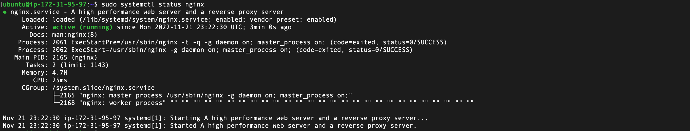
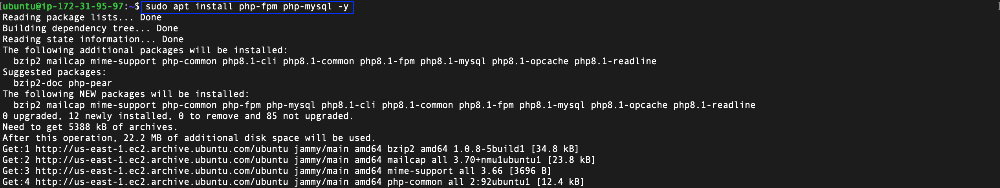
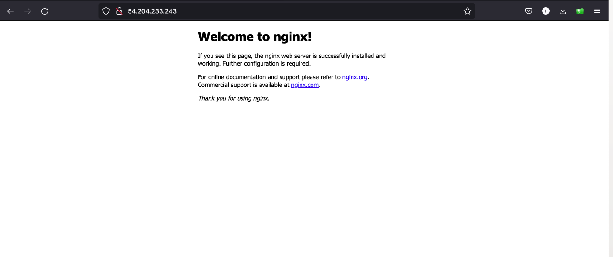
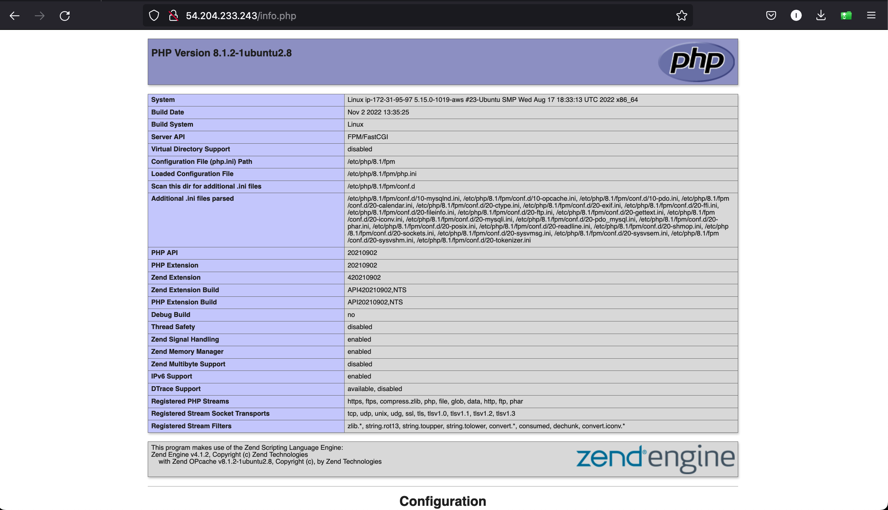

## Documentation For AWS LEMP STACK IMPLEMENTATION
# This Project shows how to implement LEMP(Linux,Nginx,Mysql,PhP) on AWS


After launching the Ubuntu Virtual machine on AWS Account, Update it using;

**`sudo apt update`**

After the update is completed, following the instruction fromt the task assigned

Install Apache using Ubuntu’s package manager ‘apt’:

**`sudo apt install nginx`**

To verify that apache2 is running as a Service in our ubuntu instance, use following command:

**`sudo systemctl status nginx`**

Below is the outcome of the apache status, which shows it is running and active




## .............................. INSTALLING MSQL................................
 --- 

Install Mysql on the ubuntu server.

 **`$ sudo apt install mysql-server -y`**


Log into the MySQL console

**`sudo mysql`**

configure a database user on and set login password for Mysql

**`ALTER USER 'root'@'localhost' IDENTIFIED WITH mysql_native_password BY 'PassWord.1';`**

Exit the shell with **`Exit`**

Start MYSQL Interactive script, this will prompt you to configure the validate password plugin.

**`sudo mysql_secure_installation`**

Confirm ability to login to Mysql by running the commmand.

**`sudo mysql -p`**

To exit the MySQL console, type:

**`mysql> exit`**


## ................................ INSTALLING PHP ..................................
---


We will install 3 packages namely php, libapache2-mod-php, php-mysql. run this command to install all packages listed.

**`sudo apt install php libapache2-mod-php php-mysql`**

Confirm the php version

**`php -v`**



At this point we have successfully installed all 4 applications that make up the lamp stack

- [x] Linux
- [x] Apache Http Server
- [x] MySQL
- [x] PHP

##  ...........CREATING A VIRTUAL HOST FOR YOUR WEBSITE USING APACHE .........

We will setup a virtual host to test the PHP script, virtual host enables you to setup multiple websites on a single server.

Create the directory for lempstackproject using ‘mkdir’ command

**`sudo mkdir /var/www/lempstackproject`**

Next, assign ownership of the directory with your current system user:

**`sudo chown -R $USER:$USER /var/www/lempstackproject`**

Create and open a new configuration file in Apache’s sites-available directory.

**`sudo vi /etc/nginx/sites-available/lempstackproject.conf`**

```
server {

listen 80;

server_name projectLEMP www.projectLEMP;

root /var/www/projectLEMP;

index index.html index.htm index.php;

location / {

try_files $uri $uri/ =404;

}

location ~ \.php$ {

include snippets/fastcgi-php.conf;

fastcgi_pass unix:/var/run/php/php8.1-fpm.sock;

}

location ~ /\.ht {

deny all;

}

}
```


**Create an index file in the lempstackproject folder.**
```
sudo echo 'Hello LEMP stack poject from hostname' $(curl -s http://169.254.169.254/latest/meta-data/public-hostname) 'with public IP' $(curl -s http://169.254.169.254/latest/meta-data/public-ipv4) > /var/www/projectlamp/index.html
```

Go to your browser and try to open your website URL using IP address:

**`http://<Public-IP-Address>:80`** 


Prefarrably you can also use the DNS name, the port is optional as it defaults to 80. 

**`http://<Public-DNS-Name>:80`**





## .............................TESTING PHP WITH NGINX.........................
---

With the default DirectoryIndex settings on Apache, the index.html file takes precedence, lets modify this and give precedence to the index.php file.

We need to edit the /etc/apache2/mods-enabled/dir.conf file and change the order in which the index.php file is listed within the DirectoryIndex directive:

**`sudo nano /var/www/lempstackproject/info.php`**

```
<?php

phpinfo();
```

**`http://54.204.233.243/info.php`**

Refresh the webpage to get a display similar to the below screenshot.



**Thank you!!**


