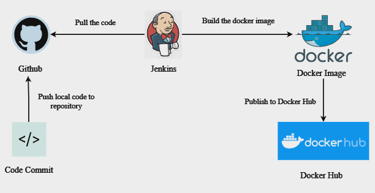
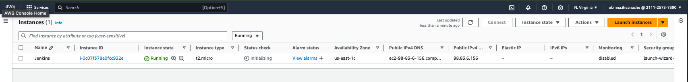
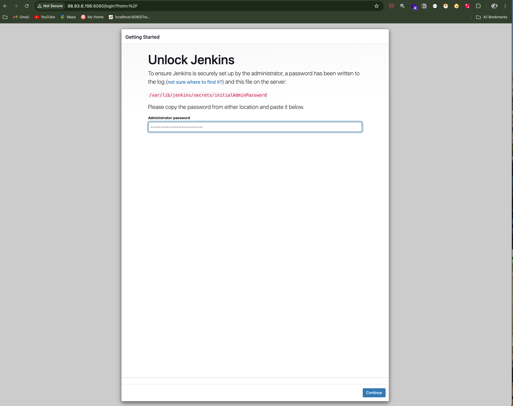
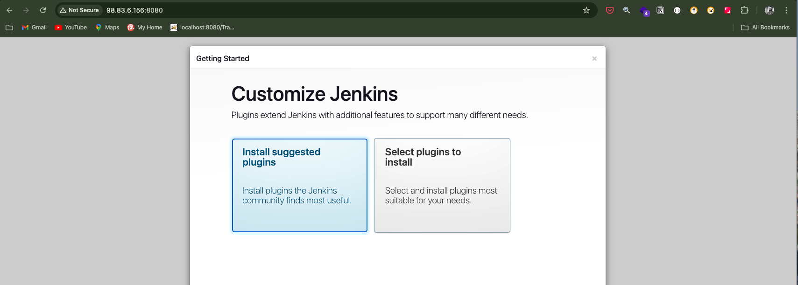
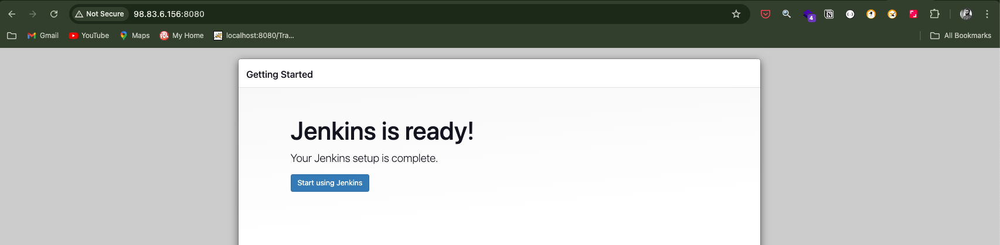

# **AUTOMATING DEPLOYMENT OF AN E-COMMERCE WEBSITE**


## **Project Description:**
In this project, I will be setting up a CI/CD Pipeline of a e-commerce website. The overall CI/CD process looks like the architecture above.

## **Pre-requisites**
* knowledge of Jenkins is required
* Knowledge of docker is required
* Knowledge of AWS is required

## **Jenkins Server Setup**

I configured my Jenkins server on AWS and included a script in the User Data field of the AWS console to automate the Jenkins installation.

### Launch Instance:
* Choose Ubuntu Server 22.04 LTS as the AMI.
* Select t2.micro as the instance type (eligible for free-tier).
* Configure network settings and make sure to allow inbound traffic on port 22 (for SSH) and port 8080   (for Jenkins web interface).
* Select your existing key pair or create a new one for SSH access.
 

 The Script below would install Jenkins
```
#!/bin/bash

# Update your package index
sudo apt update

# Install Java (required for Jenkins):
sudo apt install fontconfig openjdk-17-jre -y

# Import the GPG key and add the repository
sudo wget -O /usr/share/keyrings/jenkins-keyring.asc \
    https://pkg.jenkins.io/debian-stable/jenkins.io-2023.key
echo "deb [signed-by=/usr/share/keyrings/jenkins-keyring.asc]" \
    https://pkg.jenkins.io/debian-stable binary/ | sudo tee \
    /etc/apt/sources.list.d/jenkins.list >/dev/null

# Update the package index
sudo apt-get update

# Install Jenkins
sudo apt-get install jenkins -y

# Start Jenkins Service
sudo systemctl start jenkins

# Enable Jenkins to start at boot
sudo systemctl enable jenkins
```


By default, jenkins listens on port 8080, so i created an inbound rule for this in the security group of our jenkins instance.


### Set up Jenkins on the web console:
* Input your jenkins instance ip address on your web browser. (<http://instance_public_ip_address:8080>)
* On your Jenkins instance check "/var/lib/jenkins/secrets/initialAdminPassword" to know your password.


* Install suggested plugins
  



* Create a user account
* Log in to jenkins console
  
