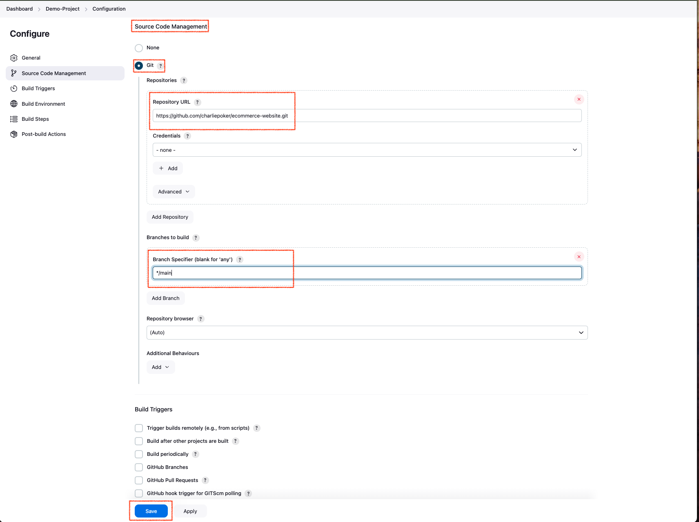
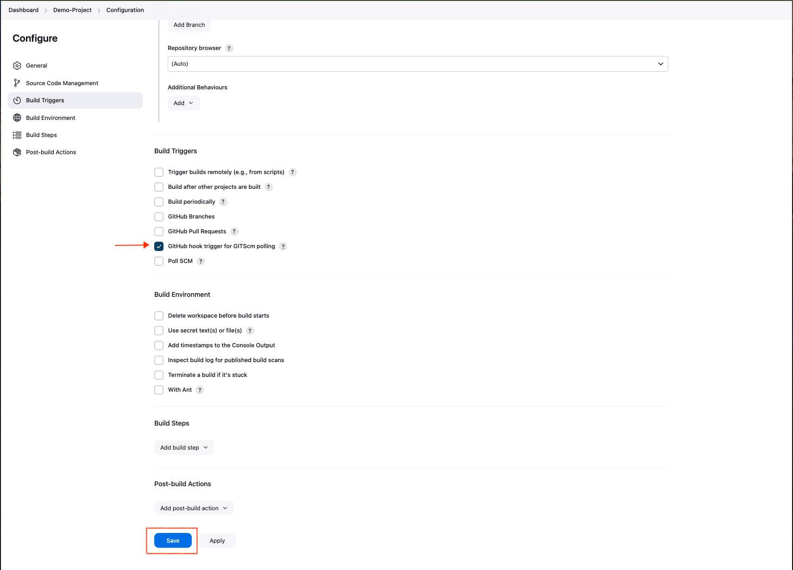

# **AUTOMATING DEPLOYMENT OF AN E-COMMERCE WEBSITE**


## **Project Description:**
In this project, I will be setting up a CI/CD Pipeline of a e-commerce website. The overall CI/CD process looks like the architecture above.

## **Pre-requisites**
* knowledge of Jenkins is required
* Knowledge of docker is required
* Knowledge of AWS is required

## **Jenkins Server Setup**

I configured my Jenkins server on AWS and included a script in the User Data field of the AWS console to automate the Jenkins installation.

### Launch Instance:
* Choose Ubuntu Server 22.04 LTS as the AMI.
* Select t2.micro as the instance type (eligible for free-tier).
* Configure network settings and make sure to allow inbound traffic on port 22 (for SSH) and port 8080   (for Jenkins web interface).
* Select your existing key pair or create a new one for SSH access.
 

 The Script below would install Jenkins
```
#!/bin/bash

# Update your package index
sudo apt update

# Install Java (required for Jenkins):
sudo apt install fontconfig openjdk-17-jre -y

# Import the GPG key and add the repository
sudo wget -O /usr/share/keyrings/jenkins-keyring.asc \
    https://pkg.jenkins.io/debian-stable/jenkins.io-2023.key
echo "deb [signed-by=/usr/share/keyrings/jenkins-keyring.asc]" \
    https://pkg.jenkins.io/debian-stable binary/ | sudo tee \
    /etc/apt/sources.list.d/jenkins.list >/dev/null

# Update the package index
sudo apt-get update

# Install Jenkins
sudo apt-get install jenkins -y

# Start Jenkins Service
sudo systemctl start jenkins

# Enable Jenkins to start at boot
sudo systemctl enable jenkins
```


By default, jenkins listens on port 8080, so i created an inbound rule for this in the security group of our jenkins instance.


### Set up Jenkins on the web console:
* Input your jenkins instance ip address on your web browser. (<http://instance_public_ip_address:8080>)
* On your Jenkins instance check "/var/lib/jenkins/secrets/initialAdminPassword" to know your password.


* Install suggested plugins
  
  

* Create a user account
* Log in to jenkins console
  
### Creating a Pipeline Job

i. From the dashboard menu on the left side, click on new item


### Connecting Jenkins to my Source Code Management

I have created a github repository that houses my demo e-commerce website. [Link to demo website](https://github.com/charliepoker/ecommerce-website.git)


Connect Jenkins to e-commerce website repository by pasting the github repository url in the area selected below. Make sure the current branch is "main"



We have successfully connected Jenkins with our github repository. 

### Configuring Build Trigger

We need to configure the build trigger to run the pipeline job whenever there is a change in the repository

i. Click "Configure" your job and add this configurations

ii. Click on build trigger to configure triggering the job from Github webhook



iii. Create a github webhook using the jenkins IP address and port.


### Writing Jenkins Pipeline Script
A jenkins pipeline script refers to a script that defines and ochestrates the steps and stages of a continous integration and continous delivery (CI/CD) pipeline. Jenkins pipeline can be defined using either declarative or scripted syntax. Declarative syntax is a more structured and concise way to define pipeline. it uses a domain-specific language to describe the pipeline stages, steps and other configurations while scripted syntax provides more flexibility and is suitable for complex scripting requirements.

Pipeline Script
```
pipeline {
    agent any

    environment {
        DOCKERHUB_CREDENTIALS = credentials('dockerhub-creds')  // Jenkins credentials ID for Docker Hub
        DOCKER_IMAGE_NAME = '8060633493/ecommerce-website'    // Your Docker Hub repository
    }

    stages {
        stage('Connect To Github') {
            steps {
                checkout scmGit(branches: [[name: '*/main']], extensions: [], userRemoteConfigs: [[url: 'https://github.com/charliepoker/ecommerce-website.git']])
            }
        }

        stage('Build Docker Image') {
            steps {
                script {
                    // Build the Docker image and tag it with 'latest'
                    sh 'docker build -t $DOCKER_IMAGE_NAME:latest .'
                }
            }
        }

        stage('Stop Existing Container on Port 8081') {
            steps {
                script {
                    // Check if any container is using port 8081 and stop it
                    sh '''
                    existing_container=$(docker ps --filter "publish=8081" -q)
                    if [ ! -z "$existing_container" ]; then
                        echo "Stopping container on port 8081"
                        docker stop $existing_container
                        docker rm $existing_container  # Clean up the stopped container
                    fi
                    '''
                }
            }
        }

        stage('Run Docker Container') {
            steps {
                script {
                    // Run a new container on port 8081
                    sh 'docker run -itd -p 8081:80 $DOCKER_IMAGE_NAME:latest'
                }
            }
        }


        stage('Push to Docker Hub') {
            steps {
                script {
                    // Log in to Docker Hub and push the image
                    sh '''
                    echo $DOCKERHUB_CREDENTIALS_PSW | docker login -u $DOCKERHUB_CREDENTIALS_USR --password-stdin
                    docker push $DOCKER_IMAGE_NAME:latest
                    docker push $DOCKER_IMAGE_NAME:latest
                    '''
                }
            }
        }
    }
}

```
This Jenkins pipeline script automates the process of building, running, and deploying a Docker image from a GitHub repository. Here’s a summary of what each part does:

1.	Environment Variables:

    •	Sets up credentials for Docker Hub (dockerhub-creds) and defines the Docker image name (8060633493/ecommerce-website).

2.	Stages:

	•	Connect to GitHub:

	•	Clones the code from the specified GitHub repository’s main branch.

	•	Build Docker Image:

	•	Builds a Docker image from the repository’s code and tags it as latest.

	•	Stop Existing Container on Port 8081: Checks if there’s a running Docker container using port 8081, stops, and removes it to free up the port.

	•	Run Docker Container: Runs a new Docker container from the latest image on port 8081.

	•	Push to Docker Hub: Logs into Docker Hub using the provided credentials and pushes the latest Docker image to the specified Docker Hub repository.

### Creating Docker Credentials in Jenkins
Creating Docker credentials in Jenkins enhances security by allowing sensitive information, like Docker Hub usernames and passwords, to be securely stored and managed instead of hardcoding them in pipeline scripts. This approach also simplifies reuse across multiple projects and enables Jenkins to automate Docker Hub login during build and deployment processes without manual intervention.

i. Go to “Manage Jenkins”

ii. Select “Manage Credentials”

iii. Click on “System” and then “Global Credentials (unrestricted)”

vi. Add  Credentials


v. Enter Docker Hub Credentials


### Create a Dockerhub Repository

A Docker Hub repository is a storage location where Docker images can be stored, shared, and managed. Creating a repository allows you to upload and host your Docker images, making them accessible for deployment on different servers or for sharing with others. It simplifies the distribution of applications by enabling version control and easy access, and is essential for automating deployments, as tools like Jenkins can pull images directly from Docker Hub for continuous integration and deployment pipelines.

i. Log In to Docker Hub

ii. Navigate to Repositories

iii. Create a New Repository

iv. Fill in Repository Details

v. Create Repository


Copy the pipeline script and paste in the section below

i. Click in the pipeline syntax


ii. Select the drop down to sesrch for `Checkout: Check out from version control`

iii. Paste your repository url and make sure it is the main branch

iv. Generate your pipeline script


### Installing Docker

Before Jenkins can run docker commands we need to install docker on the same instance Jenkins was installed. 

i. Create a file named docker.sh 

ii. Open the file and paste the script below

```
#!/bin/bash

# This script will install Docker and create a user account for Docker to run with root privileges on an Ubuntu virtual machine

# Remove any old versions of Docker
for pkg in docker.io docker-doc docker-compose docker-compose-v2 podman-docker containerd runc; do
  sudo apt-get remove -y $pkg
done

# Update the package list and install prerequisites
sudo apt-get update
sudo apt-get install -y ca-certificates curl

# Add Docker's official GPG key
sudo install -m 0755 -d /etc/apt/keyrings
sudo curl -fsSL https://download.docker.com/linux/ubuntu/gpg -o /etc/apt/keyrings/docker.asc
sudo chmod a+r /etc/apt/keyrings/docker.asc

# Add the Docker repository to APT sources
echo "deb [arch=$(dpkg --print-architecture) signed-by=/etc/apt/keyrings/docker.asc] https://download.docker.com/linux/ubuntu $(lsb_release -cs) stable" | \
  sudo tee /etc/apt/sources.list.d/docker.list > /dev/null

# Update the package list again and install Docker
sudo apt-get update
sudo apt-get install -y docker-ce docker-ce-cli containerd.io docker-buildx-plugin docker-compose-plugin

# Verify Docker installation
sudo docker run hello-world

# Check the status of the Docker service to ensure it is running
sudo systemctl status docker

# Add the 'jenkins' user to the 'docker' group so that Jenkins can run Docker commands
sudo usermod -aG docker jenkins

# Restart Jenkins to apply the group changes
sudo systemctl restart jenkins
```

iii. Save and close the file

iv. Make the file executable by running the command below 
```
chmod u+x docker.sh
```
v. Execute the file with the command below
```
./docker.sh
```
We have successfully installed docker

### Building Pipeline Script
Now that we have docker installed on the same instance with jenkins, we need to create a dockerfile before we can run our pipeline script. We have to write a dockerfile to build a docker image. We

i. Create a new file named dockerfile

ii. Paste the code snippet below in the file 
```
# Use the official Nginx image based on Alpine Linux as the base image
FROM nginx:alpine

# Copy the current directory's contents to the Nginx HTML directory
COPY . /usr/share/nginx/html

# Expose port 80 to allow external access to the Nginx server
EXPOSE 80

```
Making any changes or modifications and pushing it to the source code in the repository would automatically run new build for our pipeline


We can access our demo e-commerce website on our our browser 
```
http://jenkins-ip-address:8081
```


We can confirm that our image was successfully pushed to dockerhub after the pipeline was triggered


## Congratulations!!!, You have successfully automated the deployment of a demo website. ##