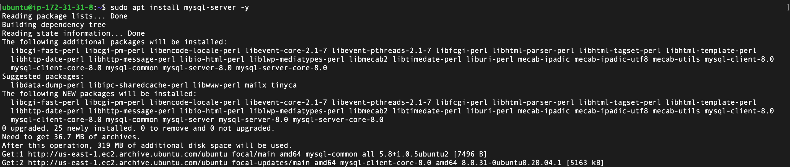

# IMPLEMENTATION OF A CLIENT SERVER ARCHITECTURE USING MYSQL DATABASE MANAGEMENT SYSTEM (DBMS).

To demonstrate a basic client-server using MySQL Relational Database Management System (RDBMS), follow the below instructions below:

1. Create and configure two Linux-based virtual servers (EC2 instances in AWS).

Server A name - `mysql server`

Server B name - `mysql client`

**Update ubuntu**

**`sudo apt update`**

**Upgrade ubuntu**

**`sudo apt upgrade`**

2. On mysql server Linux Server install MySQL Server software.

**Make sure to enable the MySQL.service after installing** 

**`sudo systemctl enable mysql`**

3. On mysql client Linux Server install MySQL Client software.

4. By default, both of your EC2 virtual servers are located in the same local virtual network, so they can communicate to each other using local IP addresses. 

Or, you can add them to the same subnets.

Use mysql server's local IP address to connect from mysql client. MySQL server uses TCP port 3306 by default, so you will have to open it by creating a new entry in ‘Inbound rules’ in ‘mysql server’ Security Groups. For extra security, do not allow all IP addresses to reach your ‘mysql server’ – allow access only to the specific local IP address of your ‘mysql client’.

5. For MySQL secure installation use the following,

6. After the installation you might need to create a password for root user

6. On MySQL server create a user and a database

7. Grant privileges

**`GRANT ALL ON test_db.* TO 'remote_user'@'%' WITH GRANT OPTION;`**

8. Flush Privileges

**`FLUSH PRIVILEGES`**

9. Exit MySQL and restart the mySQL service using 

**`sudo systemctl restart mysql`**

10. You might need to configure MySQL server to allow connections from remote hosts.

**`sudo vi /etc/mysql/mysql.conf.d/mysqld.cnf`**

11. Replace ‘127.0.0.1’ to ‘0.0.0.0’ like this:

12. From mysql client Linux Server connect remotely to mysql server Database Engine without using SSH. You must use the mysql utility to perform this action.

Check that you have successfully connected to a remote MySQL server and can perform SQL queries:

Show database

**`Show databases;`**

If you see an output similar to the below image, then you have successfully completed this project – you have deloyed a fully functional MySQL Client-Server set up.

### Thank You!!!