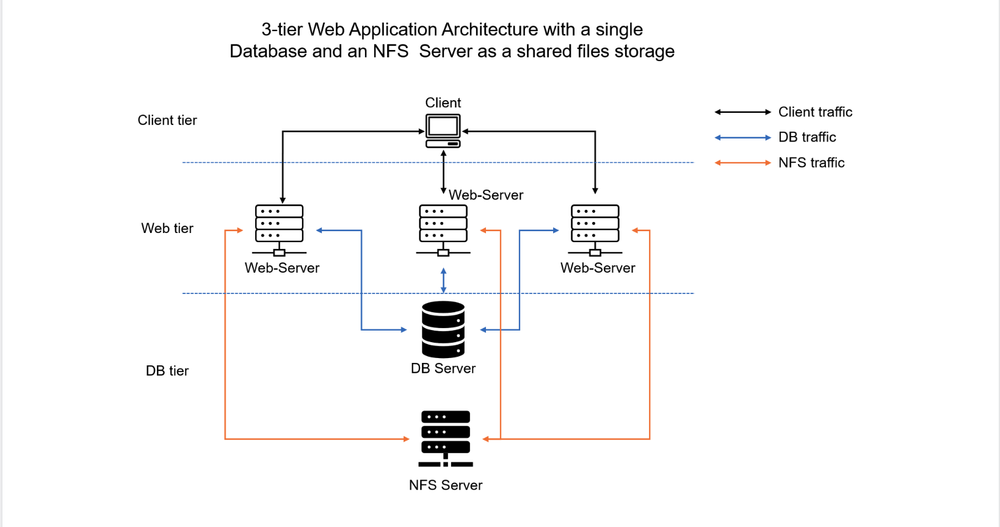
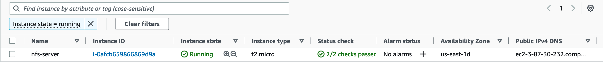
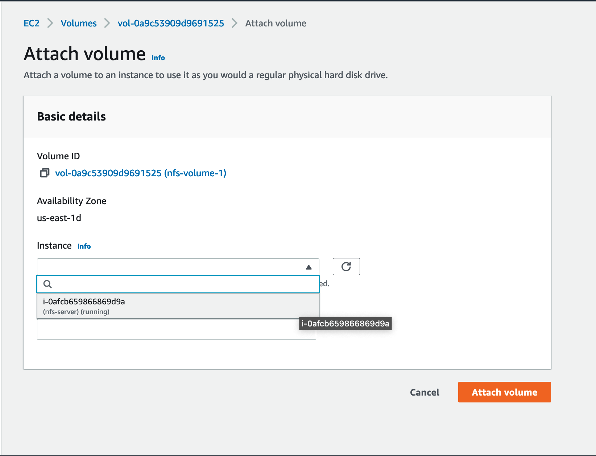
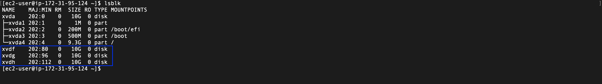
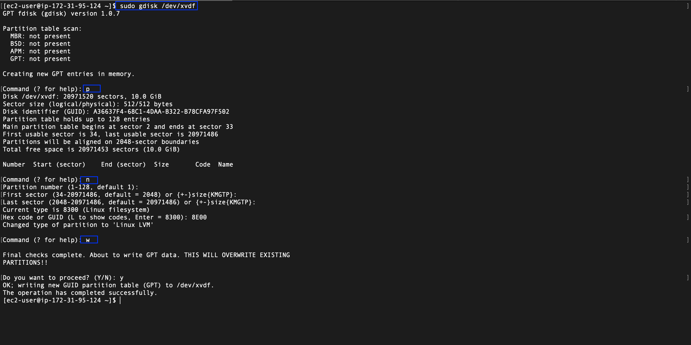
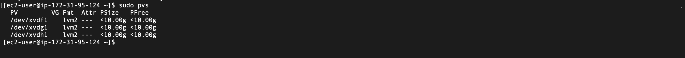
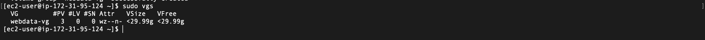
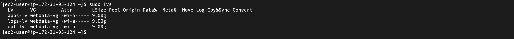

# **DEVOPS TOOLING WEBSITE SOLUTION**

In this project you will implement a solution that consists of following components:

* Infrastructure: AWS

* Webserver Linux: Red Hat Enterprise Linux 8

* Database Server: Ubuntu 20.04 + MySQL

* Storage Server: Red Hat Enterprise Linux 8 + NFS Server

* Programming Language: PHP

* Code Repository: Github



## STEP 1 – PREPARE NFS SERVER

1. Spin up a new EC2 instance with RHEL Linux 9 Operating System.



2. Create and Add  EBS volumes to the EC2 instance.



3. Open up the linux terminal to begin configuration.
   
4. Use **lsblk** command to inspect what block devices are attached to the server. 

```
$ lsblk
```



5. Use **gdisk** utility to create a single partition on each of the 3 disks

```
$ sudo gdisk /dev/xvdf
```


6. Install **lvm2** package using sudo yum install lvm2. Run **sudo lvmdiskscan** command to check for available partitions.

```
$ sudo lvmdiskscan 
```

7.  Use **pvcreate** utility to mark each of 3 disks as physical volumes (PVs) to be used by LVM

```
$ sudo pvcreate /dev/xvdf1
$ sudo pvcreate /dev/xvdg1
$ sudo pvcreate /dev/xvdh1
```

8. Verify that your Physical volume has been created successfully by running **sudo pvs**



9. Use **vgcreate** utility to add all 3 PVs to a volume group (VG). Name the VG webdata-vg

```
$ sudo vgcreate webdata-vg /dev/xvdh1 /dev/xvdg1 /dev/xvdf1
```

10. Verify that your VG has been created successfully by running **sudo vgs**



11. Use **lvcreate** utility to create 3 logical volumes. apps-lv (Use a part  of the PV size), and opt-lv Use the remaining space of the PV size for the logs-lv.

```
$ sudo lvcreate -n apps-lv -L 9G webdata-vg
$ sudo lvcreate -n logs-lv -L 9G webdata-vg
$ sudo lvcreate -n opt-lv -L 9G webdata-vg
```

12. Verify that your Logical Volume has been created successfully by running **sudo lvs**

