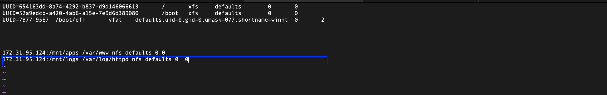

# **DEVOPS TOOLING WEBSITE SOLUTION**

In this project you will implement a solution that consists of following components:

* Infrastructure: AWS

* Webserver Linux: Red Hat Enterprise Linux 8

* Database Server: Ubuntu 20.04 + MySQL

* Storage Server: Red Hat Enterprise Linux 8 + NFS Server

* Programming Language: PHP

* Code Repository: Github


## STEP 1 – PREPARE NFS SERVER

1. Spin up a new EC2 instance with RHEL Linux 9 Operating System.


2. Create and Add  EBS volumes to the EC2 instance.


3. Open up the linux terminal to begin configuration.
   
4. Use **lsblk** command to inspect what block devices are attached to the server. 

```
$ lsblk
```


5. Use **gdisk** utility to create a single partition on each of the 3 disks

```
$ sudo gdisk /dev/xvdf
```


6. Install **lvm2** package using sudo yum install lvm2. Run **sudo lvmdiskscan** command to check for available partitions.

```
$ sudo lvmdiskscan 
```

7.  Use **pvcreate** utility to mark each of 3 disks as physical volumes (PVs) to be used by LVM

```
$ sudo pvcreate /dev/xvdf1
$ sudo pvcreate /dev/xvdg1
$ sudo pvcreate /dev/xvdh1
```

8. Verify that your Physical volume has been created successfully by running **sudo pvs**


9. Use **vgcreate** utility to add all 3 PVs to a volume group (VG). Name the VG webdata-vg

```
$ sudo vgcreate webdata-vg /dev/xvdh1 /dev/xvdg1 /dev/xvdf1
```

10. Verify that your VG has been created successfully by running **sudo vgs**


11. Use **lvcreate** utility to create 3 logical volumes. apps-lv (Use a part  of the PV size), and opt-lv Use the remaining space of the PV size for the logs-lv.

```
$ sudo lvcreate -n apps-lv -L 9G webdata-vg
$ sudo lvcreate -n logs-lv -L 9G webdata-vg
$ sudo lvcreate -n opt-lv -L 9G webdata-vg
```

12. Verify that your Logical Volume has been created successfully by running **sudo lvs**


13. sudo vgdisplay -v #view complete setup - VG, PV, and LV

```
$ sudo lsblk
```

14. Use **xfs** to format the logical volumes with ext4 filesystem

```
$  sudo mkfs -t xfs /dev/webdata-vg/lv-apps
$  sudo mkfs -t xfs /dev/webdata-vg/lv-logs
$  sudo mkfs -t xfs /dev/webdata-vg/lv-opt
```


* Ensure there are 3 Logical Volumes. lv-opt lv-apps, and lv-logs

15. Create mount points on /mnt directory for the logical volumes as follow:

    Mount lv-apps on /mnt/apps – To be used by webservers

    Mount lv-logs on /mnt/logs – To be used by webserver logs

    Mount lv-opt on /mnt/opt – To be used by Jenkins server in Project 8

```
sudo mkdir /mnt/apps

sudo mkdir /mnt/logs

sudo mkdir /mnt/opt

sudo mount /dev/webdata-vg/lv-apps /mnt/apps

sudo mount /dev/webdata-vg/lv-logs /mnt/logs

sudo mount /dev/webdata-vg/lv-opt /mnt/opt
```


* Once mount is completed run **`sudo blkid`** to get the UUID of the mount part, open and paste the UUID in the fstab file.

**`sudo vi /etc/fstab`**

```
sudo mount -a 
sudo systemctl daemon-reload
```


16. Install NFS server, configure it to start on reboot and make sure it is u and running

```
sudo yum -y update

sudo yum install nfs-utils -y

sudo systemctl start nfs-server.service

sudo systemctl enable nfs-server.service

sudo systemctl status nfs-server.service
```

17. Export the mounts for webservers’ subnet cidr to connect as clients. For simplicity, you will install your all three Web Servers inside the same subnet, but in production set up you would probably want to separate each tier inside its own subnet for higher level of security.
To check your subnet cidr – open your EC2 details in AWS web console and locate ‘Networking’ tab and open a Subnet link:


* Make sure we set up permission that will allow our Web servers to read, write and execute files on NFS:

```
sudo chown -R nobody: /mnt/apps

sudo chown -R nobody: /mnt/logs

sudo chown -R nobody: /mnt/opt

sudo chmod -R 777 /mnt/apps

sudo chmod -R 777 /mnt/logs

sudo chmod -R 777 /mnt/opt

sudo systemctl restart nfs-server.service
```

* Configure access to NFS for clients within the same subnet (example of Subnet CIDR – 172.31.32.0/20):

```
sudo vi /etc/exports

/mnt/apps <Subnet-CIDR>(rw,sync,no_all_squash,no_root_squash)
/mnt/logs <Subnet-CIDR>(rw,sync,no_all_squash,no_root_squash)
/mnt/opt <Subnet-CIDR>(rw,sync,no_all_squash,no_root_squash)

Esc + :wq!  to exit vim

sudo exportfs -arv
```


18. Check which port is used by NFS and open it using Security Groups (add new Inbound Rule)
rpcinfo -p | grep nfs


**Important note: In order for NFS server to be accessible from your client, you must also open following ports: TCP 111, UDP 111, UDP 2049**


## STEP 2 –  CONFIGURE THE DATABASE SERVER

1. Install MySQL server

**`sudo apt install mysql`**

2. Create a database and name it `tooling`
```
sudo mysql
create database tooling;
```

3. Create a database user and name it `webaccess`

**`create user 'webaccess'@'172.31.80.0/20' identified by 'password';`**

4. Grant permission to webaccess user on tooling database to do anything only from the webservers subnet cidr

**`grant all privileges on tooling.* to 'webaccess'@'172.31.80.0/20';`**


## STEP 3 - PREPARE THE WEB SERVERS

During the next steps we will do following:

* **Configure NFS client (this step must be done on all three servers)**

* **Deploy a Tooling application to our Web Servers into a shared NFS folder**

* **Configure the Web Servers to work with a single MySQL database**


1. Launch a new EC2 instance with RHEL 8 Operating System

2. Install NFS client

`sudo yum install nfs-utils nfs4-acl-tools -y`


3. Mount /var/www/ and target the NFS server’s export for apps
```
sudo mkdir /var/www
sudo mount -t nfs -o rw,nosuid <NFS-Server-Private-IP-Address>:/mnt/apps /var/www
```


4. Verify that NFS was mounted successfully by running df -h. Make sure that the changes will persist on Web Server after reboot:
```
sudo vi /etc/fstab

add following line;

<NFS-Server-Private-IP-Address>:/mnt/apps /var/www nfs defaults 0 0
```

1. Install Remi’s repository, Apache and PHP
```
$ sudo yum install httpd -y
$ sudo yum install httpd -y
$ sudo dnf upgrade --refresh -y
$ sudo dnf install \
    https://dl.fedoraproject.org/pub/epel/epel-release-latest-9.noarch.rpm \
    https://dl.fedoraproject.org/pub/epel/epel-next-release-latest-9.noarch.rpm
$ sudo dnf install dnf-utils http://rpms.remirepo.net/enterprise/remi-release-9.rpm -y
$ sudo dnf update --refresh -y
$ sudo dnf remove php php-fpm -y
$ sudo dnf remove php* -y
$ sudo dnf module list reset php -y
$ sudo dnf module list php
$ sudo dnf module enable php:remi-7.4 -y
$ sudo dnf install php -y
$ sudo dnf install php-cli php-curl php-mysqlnd php-gd php-opcache php-zip php-intl php-common php-bcmath php-imap php-imagick php-xmlrpc php-json php-readline php-memcached php-redis php-mbstring php-apcu php-xml php-dom php-redis php-memcached php-memcache
$ php -v
```

### **Repeat steps 1-5 for another 2 Web Servers.**

6. Verify that Apache files and directories are available on the Web Server in /var/www and also on the NFS server in /mnt/apps. If you see the same files – it means NFS is mounted correctly. You can try to create a new file touch test.txt from one server and check if the same file is accessible from other Web Servers.


7. Locate the log folder for Apache on the Web Server and mount it to NFS server’s export for logs. Repeat step 4 under the 'prepare web servers' to make sure the mount point will persist after reboot.


`sudo vi /etc/fstab`




1. Clone https://github.com/charliepoker/tooling


2. Deploy the tooling website’s code to the Webserver. Ensure that the html folder from the repository is deployed to `/var/www/html`


**Note 1: Do not forget to open TCP port 80 on the Web Server.**

Note 2: If you encounter 403 Error – check permissions to your `/var/www/html` folder and also disable SELinux `sudo setenforce 0`

To make this change permanent – open following config file `sudo vi /etc/sysconfig/selinux` and set `SELINUX=disabled` then restart httpd.


```
sudo systemctl restart httpd
sudo systemctl status httpd
```

1.  Update the website’s configuration to connect to the database (in /var/www/html/functions.php file). Apply tooling-db.sql script to your database using this command mysql -h <databse-private-ip> -u <db-username> -p <db-pasword> < tooling-db.sql


* Install MySQL on the web servers using **`sudo yum install mysql -y`** then cd into the tooling directory to connect to thhe database.


If you can't connect to it and there is an error simply move to the DB server to edit the inbound security group.


Then edit the mysqld.cnf file


```
sudo vi /etc/mysql/mysql.conf.d//mysqld.cnf

sudo systemctl restart mysql

sudo systemctl status mysql
```


1.  Create in MySQL a new admin user with username: myuser and password: password:

INSERT INTO ‘users’ (‘id’, ‘username’, ‘password’, ’email’, ‘user_type’, ‘status’) VALUES
-> (1, ‘myuser’, ‘5f4dcc3b5aa765d61d8327deb882cf99’, ‘user@mail.com’, ‘admin’, ‘1’);

12. Open the website in your browser http://<Web-Server-Public-IP-Address-or-Public-DNS-Name>/index.php and make sure you can login into the websute with myuser user.


### Thank You!! 

