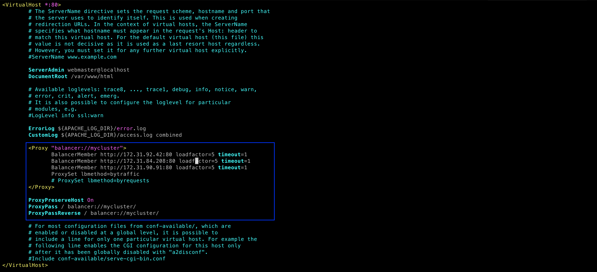

## CONFIGURE APACHE AS A LOAD BALANCER
---

Before we proceed with the project we need to make sure we have the following prerequisites

Prerequisites:

Make sure that you have following servers are installed and configured within Project-7:

* Three RHEL 9 Web Servers
* One MySQL DB Server (RHEL 9)
* One RHEL 9 NFS server


### Configure Apache As A Load Balancer
1. Create an Ubuntu Server 20.04 EC2 instance 
   
2. Open TCP port 80 on apache-lb-server by creating an inbound Rule in the Security Group.


3. Install Apache Load Balancer on the load balancer server and configure it to point traffic coming to LB to both Web Servers:

```
$ sudo apt update
$ sudo apt install apache2 -y
$ sudo apt-get install libxml2-dev
```


### Enable following modules:
```
$ sudo a2enmod rewrite
$ sudo a2enmod proxy
$ sudo a2enmod proxy_balancer
$ sudo a2enmod proxy_http
$ sudo a2enmod headers
$ sudo a2enmod lbmethod_bytraffic
```


### Restart apache2 service

`sudo systemctl restart apache2`

Make sure apache2 is up and running

`sudo systemctl status apache2`


### Configure load balancing

```
sudo vi /etc/apache2/sites-available/000-default.conf

Add this configuration into this section <VirtualHost *:80>  </VirtualHost>

<Proxy "balancer://mycluster">
               BalancerMember http://<WebServer1-Private-IP-Address>:80 loadfactor=5 timeout=1
               BalancerMember http://<WebServer2-Private-IP-Address>:80 loadfactor=5 timeout=1
               ProxySet lbmethod=bytraffic
               # ProxySet lbmethod=byrequests
        </Proxy>

        ProxyPreserveHost On
        ProxyPass / balancer://mycluster/
        ProxyPassReverse / balancer://mycluster/

#Restart apache server

sudo systemctl restart apache2
```



bytraffic balancing method will distribute incoming load between your Web Servers according to current traffic load. We can control in which proportion the traffic must be distributed by loadfactor parameter.


Verify that our configuration works – try to access your LB’s public IP address or Public DNS name from your browser:
http://<Load-Balancer-Public-IP-Address-or-Public-DNS-Name>/index.php
Note: If in the Project-7 you mounted /var/log/httpd/ from your Web Servers to the NFS server – unmount them and make sure that each Web Server has its own log directory.

Open two ssh/Putty consoles for both Web Servers and run following command:

**`sudo tail -f /var/log/httpd/access_log`**

if you get an error **404 Not Found The requested URL was not found on this server**

edit the apache2.conf

```
$ cd /etc/apache2
$ sudo vi apache2.conf
```

**Here in apache2.conf change**

```
<Directory /var/www/>
     Options Indexes FollowSymLinks
     AllowOverride None
     Require all granted
</Directory>
```
**to**

```
<Directory /var/www/>
        Options Indexes FollowSymLinks
        AllowOverride All
        Require all granted
</Directory>  
```


Try to refresh your browser page http://<Load-Balancer-Public-IP-Address-or-Public-DNS-Name>/index.php several times and make sure that both servers receive HTTP GET requests from your LB – new records must appear in each server’s log file. The number of requests to each server will be approximately the same since we set loadfactor to the same value for both servers – it means that traffic will be disctributed evenly between them.


If you have configured everything correctly – your users will not even notice that their requests are served by more than one server.


### THANK YOU!!!!

